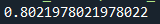
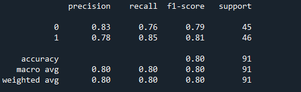
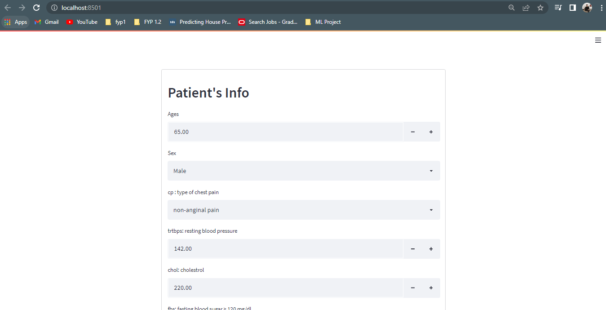
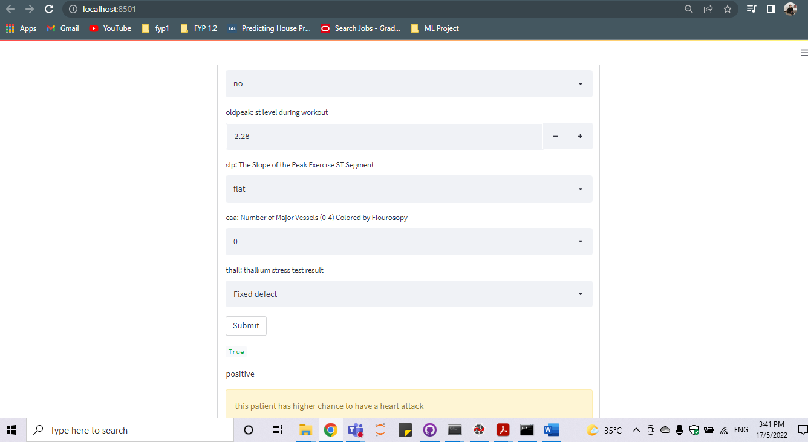

# heart_attack_analysis
  this is a project to predict weather a patient having a higher chances or lesser chances to get a heart attack

  
# How to use it
 
 heart_train.py is a script to train the data and get accuracy for the prediction
 heart_deploy.py is a script to deploy and built an app using streamlit

# Credit to
this data is from https://www.kaggle.com/rashikrahmanpritom/heart-attack-analysis-prediction-dataset

# accuracy score

# application

